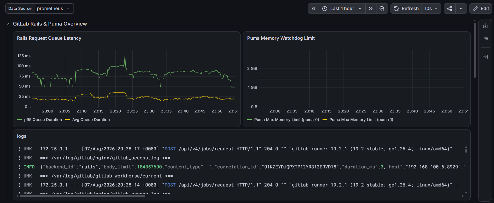
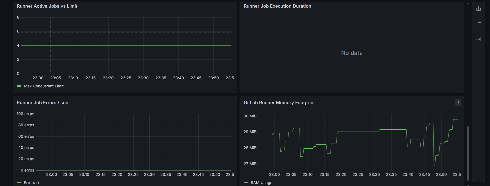

# Dashboards

Grafana dashboard exports, kept as JSON so they're versioned alongside the infrastructure they visualize instead of only existing inside Grafana's own database.

## `gitlab-application-runner-metrics.json`

Custom-built dashboard for the self-hosted GitLab instance and its Runner — see [GitLab CI/CD](../docs/GitLab-CICD.md) for the full write-up of why this is hand-built rather than an imported community dashboard.

**Data sources required:** Prometheus (metrics) and Loki (logs), both already provisioned by the [monitoring stack](../docker-compose/monitoring-grafana-promethues-cadvisor-node-exporter/).

### Rows

| Row | Panels |
|---|---|
| **GitLab Rails & Puma Overview** | Request queue latency (p95 / avg), Puma memory watchdog limit, live nginx/workhorse logs (Loki) correlated against the same timeline |
| **Database & Redis Performance** | Postgres and Redis metrics |
| **Cache & CI Metrics** | Rails cache performance, CI pipeline metrics |
| **GitLab Runner Metrics** | Active jobs vs. concurrency limit, job execution duration, job errors/sec, Runner process memory footprint |

#### GitLab Rails & Puma Overview

Request queue latency sits directly above a live Loki panel streaming GitLab's own nginx/workhorse logs — no separate dashboard needed to go from "latency spiked" to "here's what was actually happening at that moment":

The logs panel queries Loki directly rather than linking out to Explore, so a real request line like a `POST /api/v4/jobs/request` from the Runner polling for work is visible in the same timeline as the latency graph above it — pulling live logs into the same row as request latency (rather than a separate Loki-only dashboard) was a deliberate choice, not an afterthought.

#### GitLab Runner Metrics

Runner Memory Footprint hovering around 27–30 MiB confirms the Docker-executor Runner itself is genuinely lightweight at idle — the actual resource cost only shows up in the *job* containers it spins up temporarily, not the Runner process itself. Active Jobs vs. Limit tracks against the `concurrent = 1` cap set in `config.toml`, so a graph pinned at 1 during a running job (rather than climbing higher) confirms that RAM guardrail is actually being enforced, not just configured.

### Importing

**Grafana → Dashboards → New → Import → Upload JSON file**, select `gitlab-application-runner-metrics.json`, map the `DS_PROMETHEUS` variable to your Prometheus data source when prompted. The Loki panel uses your default Loki data source directly — no variable mapping needed for that one, since there's only ever one Loki instance in this stack.

### Metric naming note

Panels query GitLab's own `/-/metrics` endpoint directly (e.g. `gitlab_rails_queue_duration_seconds_bucket`, `process_resident_memory_bytes{job="gitlab-runner"}`) — these metric names come from an *externally scraped* GitLab instance with its bundled Omnibus monitoring disabled. If reusing this dashboard against a GitLab instance running its own internal Prometheus (Omnibus monitoring enabled), the metric names and job labels won't match and panels will show no data.
