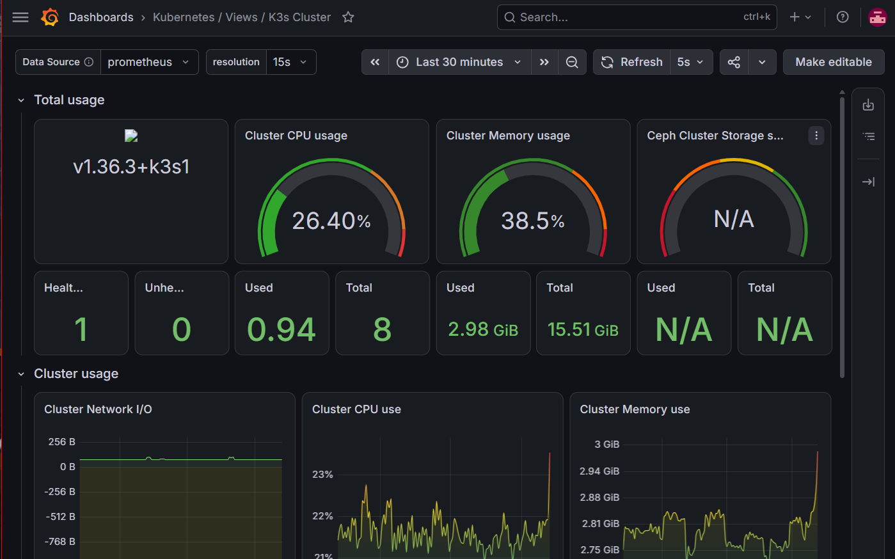

# Kubernetes Dashboards

Grafana dashboards for the K3s cluster (see [K3s](../../docs/K3s.md)). Two are imported from a community collection, two are hand-built for this homelab specifically.

## Dashboards

### `dashboard-1786902530431.json` — Kubernetes / Views / Pods

Per-pod detail view: CPU/memory usage against requests and limits, network bandwidth/packets/errors, OOM events, container restarts, throttling, QOS and priority class, and unscheduled/problem pods. Imported from [dotdc/grafana-dashboards-kubernetes](https://github.com/dotdc/grafana-dashboards-kubernetes), built for the `kube-prometheus-stack` metric set — works as-is against this cluster's `kube-state-metrics` + cAdvisor scrape targets (see [Monitoring Stack](../../docs/Monitoring-Stack.md)). Data source: Prometheus.

### `dashboard-1786902563692.json` — Kubernetes / Views / K3s Cluster

Cluster-wide overview: total/used CPU and memory gauges, node health count, per-namespace and per-node CPU/memory/network breakdowns, and cluster filesystem usage (the storage panels — Ceph, Longhorn, ZFS ZVOLs — read `N/A` here since none of those are in use; this cluster runs local-path storage only). Also from [dotdc/grafana-dashboards-kubernetes](https://github.com/dotdc/grafana-dashboards-kubernetes). Data source: Prometheus.

### `dashboard-1786902586059.json` — K3s Unified Application Dashboard

Hand-built, namespace/pod-filtered application view: running vs. problem pod counts (`kube_pod_status_phase`), per-pod CPU and memory usage (`container_cpu_usage_seconds_total`, `container_memory_working_set_bytes`), and a live Loki log stream scoped to `cluster="k3s-homeserver"`. A lighter-weight day-to-day view than the two imported dashboards above — built to answer "is *this* app healthy" rather than "how's the whole cluster." Data sources: Prometheus + Loki.

### `dashboard-1786902623268.json` — K3s Professional Log Analyzer

Hand-built, log-focused: errors-vs-warnings timeline, top error-producing pods, and a filtered live log stream with namespace/pod/container/severity/text filters. LogQL queries carry a `!~` exclusion for known-benign noise (CoreDNS's config-glob warning, `kube-state-metrics`'s `EndpointSlice` deprecation notice) so the error/warning counts reflect real issues — see [Lessons Learned](../../docs/Lessons-Learned.md). Data source: Loki. Already referenced in [Monitoring Stack](../../docs/Monitoring-Stack.md).

## Why two sets

The two imported dashboards (Pods, K3s Cluster) give broad, standard Kubernetes observability out of the box — useful for general cluster health without building anything. The two hand-built ones (Unified Application Dashboard, Professional Log Analyzer) are scoped to this specific setup: single `k3s-homeserver` cluster, Loki log correlation, and noise already filtered for the warnings this homelab actually produces. Kept side by side rather than merged, so the general-purpose community dashboards stay easy to update/re-import from upstream without losing the custom ones.
