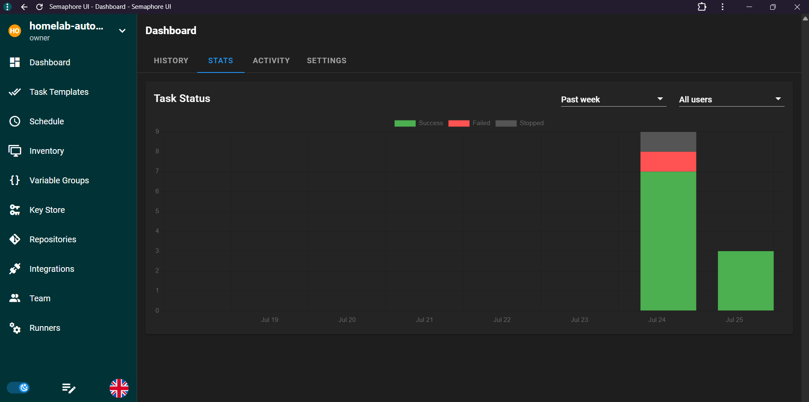

# Ansible Playbooks

How updates get applied across the homelab: one shared role, one thin playbook per stack, triggered through Semaphore. A separate provisioning playbook handles fresh server setup.

## Why

Updating each Docker Compose stack by hand — SSH in, `cd` into the folder, `docker compose pull`, `docker compose up -d`, check nothing broke, prune old images — works fine for one or two services. Across a dozen-plus stacks it gets repetitive and easy to skip steps (especially the health check after recreating containers). Ansible plus Semaphore turns that into a one-click job per stack, with consistent behavior and a visible run history.

## Structure

```
ansible/
├── README.md                                  # full directory documentation
├── update-playbooks/                          # day-to-day stack updates
│   ├── roles/
│   │   └── docker_compose_update/
│   │       └── tasks/main.yml                 # the shared update logic
│   ├── update-filebrowser.yml
│   ├── update-n8n.yml
│   ├── update-npm.yml
│   ├── update-pihole.yml
│   ├── update-plex.yml
│   ├── update-portainer.yml
│   ├── update-prowlarr.yml
│   ├── update-radarr.yml
│   ├── update-samba.yml
│   ├── update-sentinel.yml
│   ├── update-smartctl.yml
│   ├── update-sonarr.yml
│   ├── update-whisparr.yml
│   ├── update-agent-canvas.yml
│   ├── update-grafana.yml
│   └── ping.yml
│
└── preparing-playbook/                        # one-time server provisioning
    └── reza-ansible/
        ├── ansible.cfg
        ├── preparing.yaml                     # harden + Docker install
        ├── repo-server.yaml                   # Nexus + Traefik setup
        ├── inventory/
        │   ├── host.yaml
        │   ├── group_vars/all/                # shared variables
        │   └── host_vars/vagrant-test.yaml    # Vagrant overrides
        └── roles/
            ├── preparing_server/              # packages, sshd, iptables, auditd, lynis
            ├── docker/                        # Docker CE + Compose plugin
            └── repo-server/                   # Nexus3 + Traefik + registry
```

See the [ansible/ README](../ansible/README.md) for the full breakdown of every file and role.

## update-playbooks — how it works

One role, reused by every playbook. Each playbook is intentionally tiny:

```yaml
---
- hosts: all
  become: true
  vars:
    compose_dir: "/home/rezayaghobi/docker/<service>"
    service_name: "<Friendly Name>"
  roles:
    - docker_compose_update
```

Adding a new stack means adding a new playbook like the one above — no changes to the role itself.

## What the role actually does

`docker_compose_update` runs the same sequence for every stack:

1. **Records a start time**, for a duration summary at the end
2. **Snapshots `docker system df`** before the pull, so disk usage is visible
3. **Runs `docker compose pull`** in the stack's directory
4. **Snapshots `docker system df`** again after the pull — comparing the two makes it obvious when an update pulled down something unexpectedly large (this is what caught a ~9GB pull for the OpenHands/Ollama stack early on — see [AI Coding Agent](AI-Agent.md))
5. **Runs `docker compose up -d`** to recreate any containers with new images
6. **Waits 5 seconds**, then checks `docker compose ps`
7. **Asserts every container is actually up** — fails the run (and skips cleanup) if anything shows `Exit`, `Created`, or `Restarting` instead of running
8. **Runs `docker image prune -f`** to reclaim space from now-unused image layers, but only if the health check passed
9. **Prints a summary** — duration, cleanup result, pass/fail

If any step fails (a bad pull, a container that won't start), Ansible stops the play immediately rather than continuing on to prune images out from under a broken deployment.

## preparing-playbook — server provisioning

A full server preparation pipeline for fresh Ubuntu/Debian installs, designed for testing against the Vagrant VM before running on real hardware. See the [ansible/ README](../ansible/README.md) for details on each role.

### `preparing.yaml`

Runs two roles: **preparing_server** (packages, sshd, iptables, fail2ban, auditd, sysctl, lynis) then **docker** (Docker CE + Compose plugin install + daemon config).

### `repo-server.yaml`

Runs the **repo-server** role — pulls and configures Nexus3, Traefik, and a Docker registry as a self-hosted artifact repository.

### Running locally

```bash
cd ansible/preparing-playbook/reza-ansible
ansible-playbook preparing.yaml -i inventory/host.yaml
ansible-playbook repo-server.yaml -i inventory/host.yaml
```

## Running via Semaphore

Semaphore ([see Semaphore Guide](Semaphore.md)) is what actually executes these — no manual `ansible-playbook` on the server. Each playbook is set up as a Task Template pointed at this repo, so updating a stack is a matter of picking its template and hitting run.

The Semaphore dashboard gives a quick visual of run history — successes in green, failures in red:



## Lessons learned

- Keeping the update logic in a single role instead of copy-pasting it into every playbook means a fix or improvement (like the disk-usage snapshots) only has to happen once — see the role's own history for an example of that in practice.
- The `docker system df` before/after comparison earns its place: it's what made an unexpectedly large image pull for OpenHands/Ollama visible immediately, instead of just being a mystery bandwidth spike after the fact.
- The health-check assert before pruning matters — pruning images out from under a stack that failed to come back up would make debugging (and rolling back) harder, not easier.
- Testing provisioning playbooks against a disposable Vagrant VM first catches issues like sshd port mismatches and iptables misconfigurations before they lock you out of real hardware.

[← Back to Home](Home.md)
