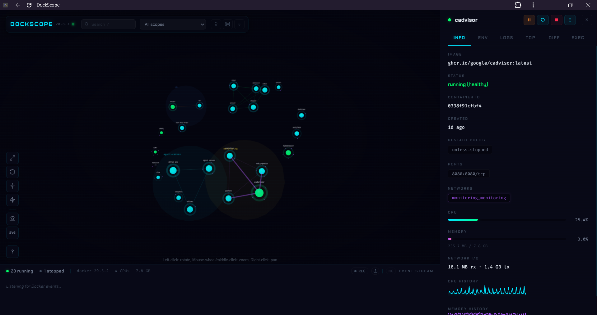

# DockScope

A 3D visual dashboard for the Docker host — lets you see every container, network, and dependency as an interactive node graph instead of scrolling through `docker ps` output.

## Why I added it

Portainer already covers day-to-day container management, but it doesn't give a great sense of *how things relate to each other* — which containers share a network, which services depend on which, and what would break if a given container went down. [DockScope](https://github.com/ManuelR-T/dockscope) fills that gap: it builds a live, interactive map of the whole Docker environment, grouping containers by Compose project and drawing connections based on shared networks. The graph updates in real time as containers start, stop, or restart.

## What it actually adds beyond the visuals

The 3D graph is the first thing you notice, but the more useful part is what's built into each container's detail panel:

- **Info tab** — image, status, container ID, uptime, restart policy, ports, connected networks, and live CPU/memory graphs
- **Env tab** — the environment variables the container was started with
- **Top tab** — running processes inside the container
- **Logs tab** — live-tailing logs
- **Exec tab** — an in-browser shell into the container

In practice this covers most of what I'd otherwise reach for `docker exec`, `docker logs -f`, or `docker top` to check — all in one UI, one click away, without opening a terminal.

It also has a few features aimed specifically at troubleshooting:

- **Anomaly detection** — flags CPU/memory spikes using outlier detection, with a pulsing indicator on the affected node
- **Crash diagnostics** — when a container dies, it looks at the exit code, OOM status, and recent logs to suggest a likely cause
- **Dependency impact view** — highlights everything that would be affected if a specific container went down
- **Health check event stream** — a live feed of container health check transitions

## Installation

Same pattern as everything else in this repo — one Compose file, no database to set up:

```yaml
services:
  dockscope:
    image: ghcr.io/manuelr-t/dockscope:latest
    container_name: dockscope
    ports:
      - "4681:4681"
    volumes:
      - /var/run/docker.sock:/var/run/docker.sock
    restart: unless-stopped
    pull_policy: always
```

Start it and open the web UI — it discovers the existing Docker environment automatically, no manual configuration needed.

## Security note

Like Portainer, DockScope needs access to `/var/run/docker.sock` to see and manage containers — that socket is effectively root-equivalent access to the host, so it's worth treating this container with the same trust level as any other tool with Docker socket access. As of this writing, DockScope also has no built-in authentication on its web UI, so it's only reachable inside the LAN here, not exposed through the reverse proxy.

## Screenshot from this homelab

The Info tab for `cadvisor`, showing live CPU/memory usage, network I/O, and history graphs pulled straight from the running container:



## Further reading

- [DockScope on GitHub](https://github.com/ManuelR-T/dockscope/tree/main)
- [Virtualization Howto: This Free Docker Dashboard Shows Your Entire Stack in 3D](https://www.virtualizationhowto.com/2026/07/this-free-docker-dashboard-shows-your-entire-stack-in-3d/) — the writeup that pointed me to this project

[← Back to Home](Home.md)
