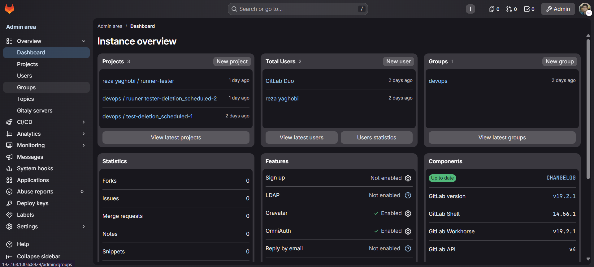
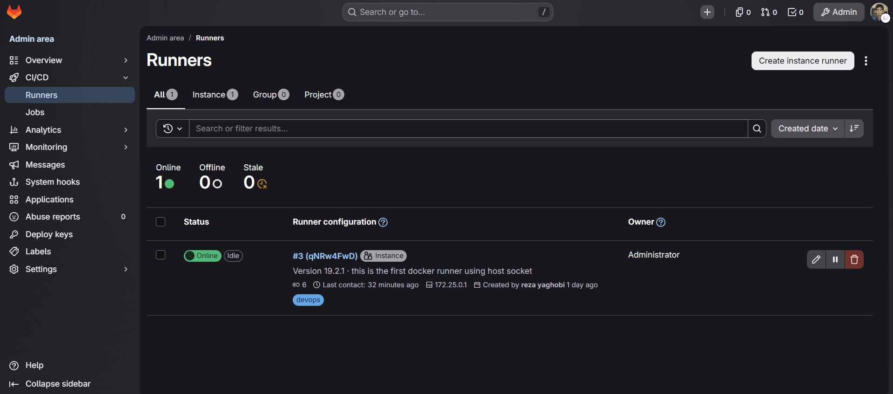

# GitLab CI/CD

A self-hosted GitLab instance (Omnibus, Docker) with a Docker-executor Runner, wired into the existing Prometheus/Grafana/Loki stack. Built as a DevOps coursework exercise, tuned to actually run on this hardware rather than GitLab's default sizing assumptions.

## Why self-hosted instead of gitlab.com

The coursework required hands-on CI/CD administration — runners, executors, pipeline internals — which a SaaS instance abstracts away. Self-hosting also surfaced a real constraint the course didn't cover: GitLab is bound by U.S. OFAC sanctions and blocks registry access from several countries, which turned into a genuine debugging exercise (see below).

## Sizing for the hardware

GitLab's own docs recommend 8GB+ RAM for even a minimal instance. This host has 8GB total, shared with the rest of the always-on stack. Omnibus was tuned down rather than run at defaults:

```yaml
puma['worker_processes'] = 2
puma['min_threads'] = 1
puma['max_threads'] = 4
sidekiq['max_concurrency'] = 10
postgresql['shared_buffers'] = "256MB"
```

GitLab Omnibus also bundles its own Prometheus/Alertmanager/exporters — all disabled here, since the host already runs its own monitoring stack:

```yaml
prometheus_monitoring['enable'] = false
alertmanager['enable'] = false
node_exporter['enable'] = false
redis_exporter['enable'] = false
postgres_exporter['enable'] = false
gitlab_exporter['enable'] = false
```

Note: `grafana['enable']` is **not** a valid key on current Omnibus versions — GitLab dropped bundled Grafana entirely (not just disabled it), and setting this key causes a hard `reconfigure` failure (`Reading unsupported config value grafana`) rather than a silent no-op. Worth knowing if following an older guide.

Container Registry was initially left disabled, then enabled once a real use case existed — see [Custom CI Runner Images](CI-Custom-Images.md), which builds and stores self-built Docker images for use inside pipelines rather than relying on generic public images.



## Runner

Runs as a separate container (`gitlab-runner`) using the Docker executor, sharing the host's Docker daemon via a mounted socket rather than Docker-in-Docker or a dedicated VM — the lightest option that still gives each job its own isolated, ephemeral container.

```yaml
gitlab-runner:
  image: gitlab/gitlab-runner:latest
  ports:
    - "9252:9252"   # runner's own Prometheus metrics endpoint
  volumes:
    - ./runner-config:/etc/gitlab-runner
    - /var/run/docker.sock:/var/run/docker.sock
```

`concurrent = 1` in `config.toml` caps job concurrency to one at a time — a deliberate RAM guardrail rather than an oversight, given how little headroom this host has.



### Registry sanctions block

First test pipeline failed instantly with `denied: error code 1009` pulling GitLab's helper image from `registry.gitlab.com`. This isn't a config or auth issue — GitLab's export-compliance policy explicitly names Iran (along with Cuba, North Korea, Syria, and Crimea) as embargoed under OFAC sanctions, enforced at the registry level regardless of account/token.

Fix: override the helper image to pull from Docker Hub instead, which isn't sanctions-blocked:

```toml
[runners.docker]
  helper_image = "gitlab/gitlab-runner-helper:x86_64-latest"
  pull_policy = "if-not-present"
```

`pull_policy = "if-not-present"` also means both the helper and job images get cached locally after the first pull, so later jobs don't depend on external registry availability at all.

## Monitoring integration

GitLab's own `/-/metrics` endpoint (Prometheus format) is separate from the bundled monitoring stack disabled above — it's still fully functional and scraped by the existing Prometheus:

```yaml
- job_name: 'gitlab'
  metrics_path: '/-/metrics'
  static_configs:
    - targets: ['192.168.100.6:8929']

- job_name: 'gitlab-runner'
  static_configs:
    - targets: ['192.168.100.6:9252']
```

By default GitLab only allows `127.0.0.1` to scrape metrics; since Prometheus reaches it over a Docker bridge network (not literally localhost), the whitelist was widened to cover private ranges:

```yaml
gitlab_rails['monitoring_whitelist'] = ['127.0.0.1', '10.0.0.0/8', '172.16.0.0/12', '192.168.0.0/16']
```

A custom Grafana dashboard (`dashboards/gitlab-application-runner-metrics.json`) was built by hand rather than importing GitLab's official community dashboard (ID `10990`) — that dashboard targets metric names from Omnibus's *own* bundled Prometheus setup, which was disabled above, so the metric names don't match what this external Prometheus actually scrapes. Panels cover Rails/Puma request queue latency, Sidekiq/Redis/Postgres performance, and Runner job/memory metrics — plus a live Loki logs panel embedded alongside the Rails/Puma metrics, so a latency spike and its corresponding nginx/workhorse log lines are visible in the same view. See [`dashboards/README.md`](../dashboards/README.md) for the full panel breakdown.

Logs flow into the existing Loki/Alloy pipeline automatically, since Alloy discovers all running containers via the Docker socket — no GitLab-specific log config needed.

## HTTPS

Fronted by the existing Nginx Proxy Manager + Pi-hole setup, same pattern as other services in this repo — see [Reverse Proxy](Reverse-Proxy.md). `external_url` in `docker-compose.yml` was updated to match the HTTPS domain, since GitLab uses this value to generate every internal link (clone URLs, CI job links, webhook payloads) — leaving it pointed at the old plain-HTTP IP after adding the proxy would have produced broken/mixed-content links throughout the UI.

## Backups

Weekly, single retained copy, sized for available disk space (~50GB free at time of writing). Script: [`docker-compose/gitlab/backups/gitlab-backup.sh`](../docker-compose/gitlab/backups/gitlab-backup.sh), scheduled via root's crontab (needs root to read GitLab's root-owned config/secrets files):

```
0 2 * * 0 /home/rezayaghobi/backups/run-backup.sh
```

Three things get backed up separately since they're owned/generated differently:

1. **GitLab's own backup** (`gitlab-backup create`) — repos, database, uploads. Does *not* include secrets by design.
2. **`config/`** — `gitlab.rb`, `gitlab-secrets.json`, SSH host keys. Root-owned by the container; without this a restored backup is unreadable.
3. **Runner `config.toml`** — small, but losing it means re-registering the runner from scratch.

Pruning keeps only the newest file of each type (`find ... | sort -rn | tail -n +2 | xargs rm`) rather than a time-based retention window, to stay predictable on limited disk space. Verified restorable by listing the archive contents (`tar tf`) after the first run, not just assumed from a non-zero exit code.

## Lessons learned

- GitLab Omnibus's RAM recommendations assume dedicated hardware — running it alongside an existing service stack requires trimming Puma/Sidekiq workers explicitly, not just relying on defaults.
- Newer Omnibus versions removed bundled Grafana as a *feature*, not just disabled it — the `grafana['enable']` key no longer exists and hard-fails `reconfigure` if set, unlike other monitoring toggles which are still valid no-ops.
- `registry.gitlab.com` access is geo-blocked under U.S. sanctions for several countries at the infrastructure level — no account or token change works around it; the fix is sourcing images from an unaffected registry (Docker Hub, in this case) instead.
- GitLab's Docker-executor helper image pull happens on the **host's** Docker daemon before the job container's own networking is even relevant — a failure here isn't a job-container network issue, it's a host-level registry pull issue.
- Community Grafana dashboards built against GitLab's *bundled* Omnibus Prometheus setup don't work against an externally-scraped `/-/metrics` endpoint — the metric names differ. Worth checking a dashboard's expected data source shape before assuming an empty panel means broken config.
- Files created inside a bind-mounted volume by a root-running container (GitLab's `config/`, `data/backups/`) are root-owned on the host — backup scripts touching these need to run as root and explicitly `chown` their own output back to the regular user afterward, or every later interaction with the backup needs `sudo`.
