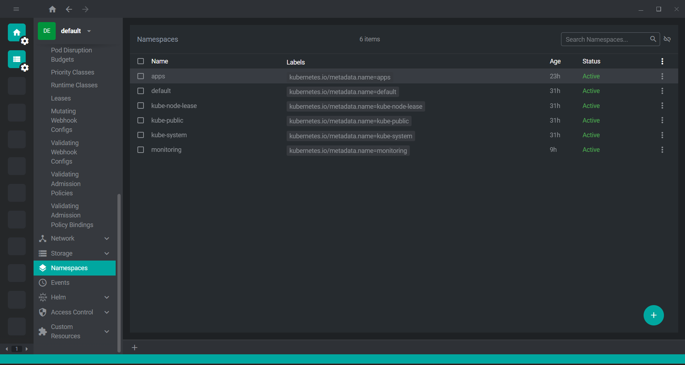
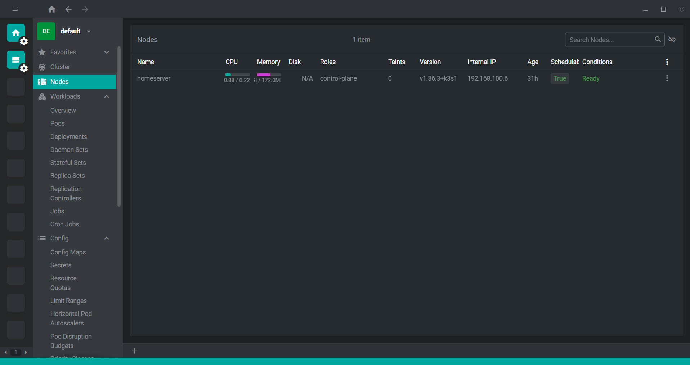

# K3s

A single-node K3s cluster running alongside the existing Docker Compose stack — the first step toward learning Kubernetes hands-on rather than purely through theory, without disrupting the services already running on this host.

## Why K3s, not kind or full kubeadm

Full `kubeadm` Kubernetes runs a separate etcd cluster plus independent API server, controller-manager, and scheduler processes — too much overhead for this host's RAM budget. `kind` runs each cluster node as a Docker container, which nests Kubernetes' own networking and iptables rules inside a host that already has Docker managing iptables for 25+ services — more surface area for conflicts, not less, and better suited to disposable CI/test clusters than a persistent homelab service.

K3s runs as a single systemd-managed binary directly on the host, with SQLite (via `kine`) standing in for etcd on a single-node setup — the lightest option that still behaves like real Kubernetes.

## Install

```bash
curl -sfL https://get.k3s.io | INSTALL_K3S_EXEC="server \
  --disable=traefik \
  --disable=servicelb \
  --flannel-backend=vxlan \
  --write-kubeconfig-mode=644" sh -
```

- **`--disable=traefik` / `--disable=servicelb`** — K3s ships with its own ingress controller and LoadBalancer implementation, both of which try to bind ports 80/443. This host's reverse proxy (see [Reverse Proxy](Reverse-Proxy.md)) already owns those ports — disabling K3s's defaults avoids the conflict entirely rather than debugging it after the fact.
- **`--flannel-backend=vxlan`** — explicit rather than relying on the default, and chosen over `host-gw` since VXLAN works across nodes that aren't on the same L2 segment, keeping the door open for a future worker node.
- **`--write-kubeconfig-mode=644`** — makes `/etc/rancher/k3s/k3s.yaml` world-readable so a personal, non-root kubeconfig copy can be made without repeated `sudo`.

## Exposure pattern: Traefik → ingress-nginx → Ingress

K3s is fronted by the existing Docker-side Traefik reverse proxy, which already owns ports 80/443 (see [Reverse Proxy](Reverse-Proxy.md)). Because K3s itself can't bind those ports, the current standard for exposing an in-cluster service is:

```
Client → Traefik (:80/:443) → ingress-nginx NodePort → Ingress → Service → Pod
```

1. **Traefik** (Docker container) terminates TLS (`*.home.server` via mkcert) and routes by `Host` header, same as every Docker Compose service.
2. **ingress-nginx** runs inside K3s. Its `Service` is exposed as a **NodePort** on the host, giving Traefik a stable `homeserver:<nodeport>` target to forward to — no new ports on the K3s side, no port conflicts with the host's Traefik.
3. **ingress-nginx** (the in-cluster Ingress controller) matches the request against `Ingress` resources in the cluster and forwards to the right `Service`.
4. **Service → Pod** as normal Kubernetes routing.

This keeps a single TLS termination layer and a single DNS entry point (`*.home.server` via Pi-hole), while letting in-cluster `Ingress` resources carry the routing logic as code alongside the workloads they protect. Any app deployed via [Argo CD](ArgoCD.md) follows this pattern — its `Ingress` (e.g., `kubernetes/apps/homepage/ingress.yaml`) is served by ingress-nginx behind the NodePort.

### Legacy NodePort-only services

The earlier kube-state-metrics deployment was exposed as a standalone `Service` of `type: NodePort` without an in-cluster Ingress — a simpler approach used before ingress-nginx was introduced. Services still using that legacy pattern (direct NodePort, no Ingress object) continue to work the same way: Traefik forwards to `homeserver:<nodeport>` and the Service routes to Pods directly. New work should use the ingress-nginx path above unless a service genuinely has no need for `Host`-based routing.

## Namespace and resource governance

All workloads live in a dedicated `apps` namespace (not `default`), governed by a `LimitRange` and `ResourceQuota` sized for this host's RAM budget:

```yaml
apiVersion: v1
kind: LimitRange
metadata:
  name: apps-limits
  namespace: apps
spec:
  limits:
  - type: Container
    default:        { cpu: "200m", memory: "256Mi" }
    defaultRequest:  { cpu: "50m",  memory: "64Mi" }
    max:             { cpu: "500m", memory: "512Mi" }
    min:             { cpu: "10m",  memory: "16Mi" }
---
apiVersion: v1
kind: ResourceQuota
metadata:
  name: apps-quota
  namespace: apps
spec:
  hard:
    requests.cpu: "1"
    requests.memory: "768Mi"
    limits.cpu: "1.5"
    limits.memory: "1.5Gi"
    pods: "10"
```

Any container deployed without explicit resource fields automatically inherits the `LimitRange` defaults; no container can exceed the `max` bounds even if it tries; and the whole namespace is hard-capped at 1.5 CPU / 1.5Gi RAM combined — protecting the Docker services and the OS from a runaway K8s workload, regardless of how many pods end up running.

## Backups

The cluster's SQLite state (`/var/lib/rancher/k3s/server/db/state.db`) is backed up on a rolling schedule via a systemd timer — deliberately off the OS disk, onto a separate physical drive:

```bash
sqlite3 "$DB_PATH" ".backup '$BACKUP_FILE'"
gzip "$BACKUP_FILE"
# keep only the 2 most recent, prune the rest
```

Runs every 4 days via `OnUnitActiveSec=4d` with `Persistent=true`, so a missed run (host powered off) catches up on next boot rather than silently skipping. This covers cluster state — Deployments, Services, config — not data inside PersistentVolumes; there are no stateful workloads in the cluster yet, so that gap doesn't currently apply.

## kubectl ergonomics

- Personal kubeconfig at `~/.kube/config` (copied from `/etc/rancher/k3s/k3s.yaml`), with `KUBECONFIG` explicitly exported in `.zshrc` — avoids the k3s-bundled `kubectl` silently falling back to its own default path and disagreeing with other tools about which config is authoritative.
- `kubectx` / `kubens` for fast context and namespace switching, plus oh-my-zsh's `kubectl` plugin for tab-completion and short aliases (`kgp`, `kgd`, `kaf`, etc.).
- Default namespace set to `apps` via `kubens apps`, so day-to-day commands don't need `-n apps` on every invocation.

## GUI: FreeLens

[FreeLens](https://github.com/freelensapp/freelens) — the actively maintained, fully open-source fork of Lens, created after the original Lens IDE moved behind a paid subscription. Same core experience (cluster overview, live workload view, logs, terminal) reading the same kubeconfig, with no account and no license cost — a better fit for a self-hosted learning project than a subscription tool.





## Monitoring integration

Rather than deploying a second Prometheus/Grafana/Loki stack inside K3s, the existing Docker-based monitoring stack (see [Monitoring Stack](Monitoring-Stack.md)) was extended to scrape and tail the K3s cluster as an additional source — avoiding the RAM cost of duplicate infrastructure.

**The gap this closes:** K3s uses containerd, not Docker, so the existing cAdvisor container (which watches the Docker socket) has no visibility into K8s pods at all. Two things bridge that gap:

- **[`kube-state-metrics`](https://github.com/kubernetes/kube-state-metrics)** — deployed into the cluster, exposes object-level state (deployment replica counts, pod restarts, resource requests vs. limits) as Prometheus metrics via a NodePort.
- **Kubelet's built-in cAdvisor** — already running as part of K3s, exposes per-pod CPU/memory at `https://<host>:10250/metrics/cadvisor`. Requires a bearer token, unlike the open Docker cAdvisor endpoint — sourced from a scoped `ServiceAccount` created specifically for external Prometheus access.

Both added as standard Prometheus scrape jobs, authenticated via a `ClusterRole` limited to read-only access on nodes, pods, and services — no broader cluster privileges than the metrics actually require.

**Logs** follow the same pattern: Grafana Alloy's `discovery.kubernetes` + `loki.source.kubernetes` components stream pod logs through the K8s API (each needing its own `client` block with the same kind of scoped token — the two components don't share credentials even when defined side-by-side), landing in the same Loki instance as the Docker container logs. K3s pod log streams carry a `cluster="k3s-homeserver"` label to distinguish them from Docker-origin entries at query time.

## Registry access under sanctions

`registry.k8s.io` (Google-hosted) returns a hard `403 Forbidden` from this network — a harder block than the intermittent Docker Hub flakiness described elsewhere in this wiki, and one that will resurface for any future addon (cert-manager, ingress-nginx, etc.) that defaults to pulling from it.

**Working pattern when this happens:**
```bash
docker pull <community-mirror-image>       # Docker Hub / ghcr.io usually reachable
docker save <image> -o /tmp/image.tar
sudo k3s ctr images import /tmp/image.tar   # load directly into containerd
```
Sidesteps `registry.k8s.io` entirely by pulling through Docker (which has working access) and importing straight into containerd's local store, rather than waiting on network access that isn't coming.

## Why this matters

The instinct to keep K3s and the existing Docker stack cleanly separated — one reverse proxy, one monitoring stack, one set of conventions — paid off directly: every new K8s workload is visible in the same Grafana instance, fronted by the same TLS setup, without a second parallel toolchain to maintain. On a four-core host with limited RAM, reusing existing infrastructure instead of duplicating it isn't just tidier — it's the difference between K3s fitting on this hardware at all and it competing with everything else already running here.
