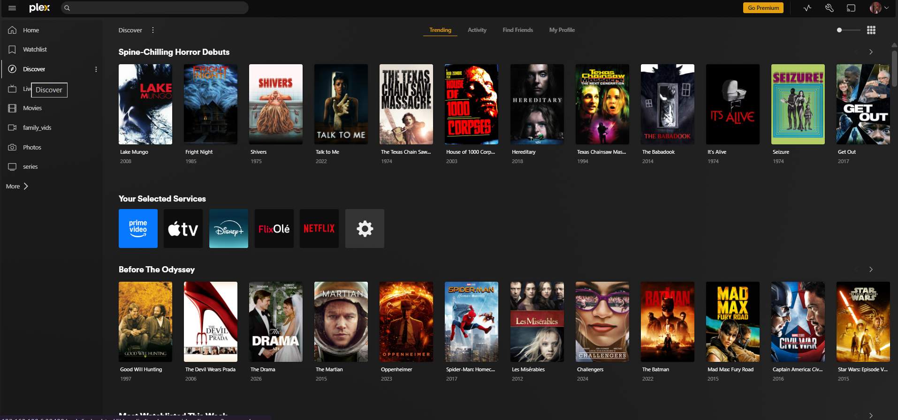

# Media Automation

A self-hosted media stack: Plex serves the library, while Sonarr, Radarr, and Prowlarr handle automated indexing and library management, backed by qBittorrent as the download client.

## Stack

| Service | Role |
|---|---|
| Plex | Media server and streaming frontend |
| Sonarr | TV library automation |
| Radarr | Movie library automation |
| Prowlarr | Indexer management, shared across the *arr apps |
| qBittorrent | Download client |

Each runs as its own Compose stack under `mediastack/`, so any one service can be updated or restarted independently.
