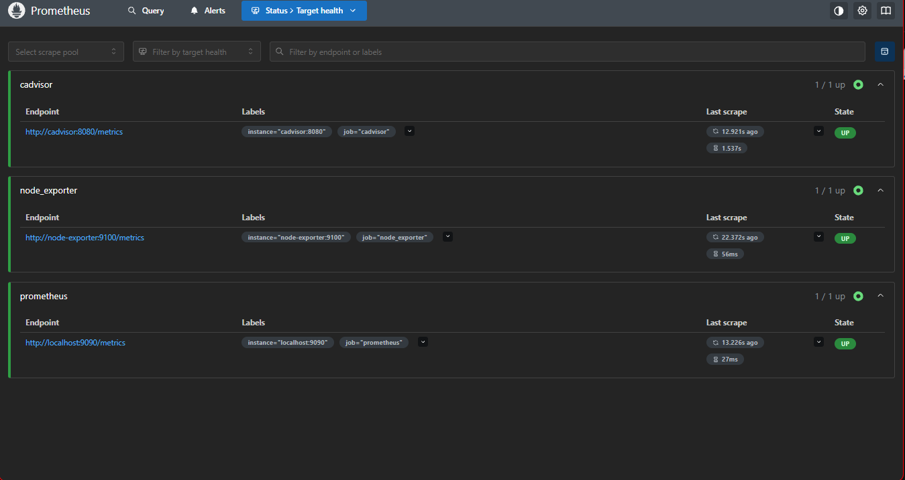
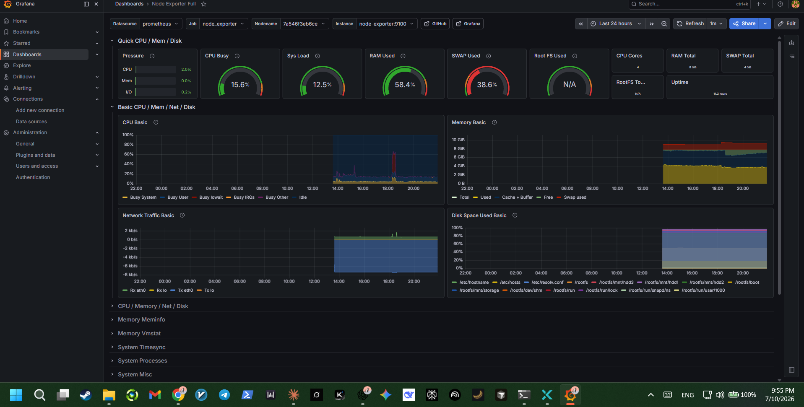

# Monitoring Stack

Prometheus, Grafana, cAdvisor, and node-exporter running together give full visibility into both the host and every container on it — essential on modest hardware where knowing what's consuming resources matters.

## Components

- **Prometheus** — scrapes and stores time-series metrics from every target below
- **node-exporter** — exposes host-level metrics (CPU, memory, disk, network)
- **cAdvisor** — exposes per-container resource usage
- **Grafana** — dashboards on top of Prometheus data

## Prometheus targets

All scrape targets healthy and reporting:

## Grafana: Node Exporter Full dashboard

Host-level metrics — CPU, memory, swap, disk, and network — over a rolling 24-hour window:

## Why this matters

On a lower-spec host, resource headroom is limited. Having per-container and host-level metrics from day one means a runaway container or a creeping memory leak shows up on a dashboard before it takes the box down — instead of finding out from an outage.
