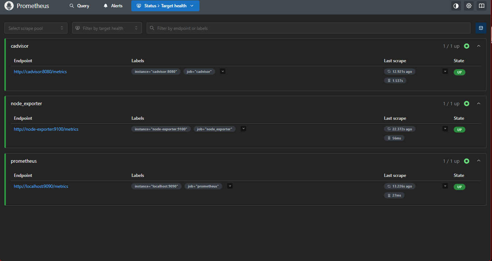
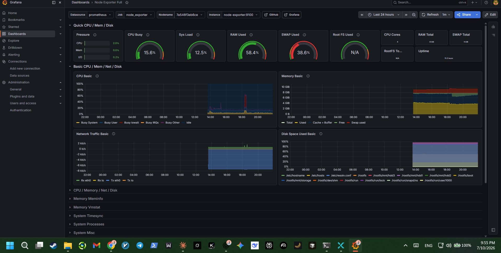

# Monitoring Stack

Prometheus, Grafana, cAdvisor, and node-exporter running together give full visibility into both the host and every container on it — essential on modest hardware where knowing what's consuming resources matters. Loki and Grafana Alloy extend this from metrics into logs, so container output is searchable in the same place instead of living only in `docker logs`.

## Components

- **Prometheus** — scrapes and stores time-series metrics from every target below
- **node-exporter** — exposes host-level metrics (CPU, memory, disk, network)
- **cAdvisor** — exposes per-container resource usage
- **Grafana** — dashboards on top of Prometheus and Loki data
- **Loki** — stores and indexes logs by label, not full text, keeping it lightweight
- **Grafana Alloy** — discovers every running container and ships its logs to Loki

## Prometheus targets

All scrape targets healthy and reporting:



## Grafana: Node Exporter Full dashboard

Host-level metrics — CPU, memory, swap, disk, and network — over a rolling 24-hour window:



## Centralized logging with Loki + Alloy

Every running container's logs get discovered and tagged automatically — no per-service logging config needed anywhere else in this repo. Alloy watches the Docker socket, picks up new containers as they start, and labels each log stream with `container`, `container_name`, `service_name`, and `instance` before forwarding to Loki.

Note: this uses **Grafana Alloy**, not Promtail — Promtail reached end-of-life in March 2026 and was removed outright as of Loki 3.7.3, with its functionality folded into Alloy. Any current Loki setup should be built on Alloy rather than following older Promtail-based tutorials.

Logs are browsable two ways in Grafana:

- **Explore → Loki**, querying by label directly (e.g. `{container="grafana"}`)
- **Drilldown → Logs**, a zero-config log browser bundled with Grafana — no dashboard needed to start exploring

## GitLab & Runner metrics

Self-hosted GitLab (see [GitLab CI/CD](GitLab-CICD.md)) exposes its own Prometheus-format metrics at `/-/metrics`, separate from Omnibus's bundled monitoring stack, which is disabled here in favor of this existing setup. The Runner similarly exposes its own metrics endpoint once `listen_address` is set in `config.toml`. Both are added as standard Prometheus scrape targets:

```yaml
- job_name: 'gitlab'
  metrics_path: '/-/metrics'
  static_configs:
    - targets: ['192.168.100.6:8929']

- job_name: 'gitlab-runner'
  static_configs:
    - targets: ['192.168.100.6:9252']
```

Visualized on a hand-built Grafana dashboard (`dashboards/gitlab-application-runner-metrics.json`) rather than GitLab's official community dashboard — that one targets metric names from Omnibus's own bundled Prometheus, which isn't what's running here.

## Why this matters

On a lower-spec host, resource headroom is limited. Having per-container and host-level metrics from day one means a runaway container or a creeping memory leak shows up on a dashboard before it takes the box down — instead of finding out from an outage. Centralized logs close the other half of that gap: when a container *does* misbehave, its logs are searchable and correlated against the same timeline as its resource usage, rather than requiring a separate `docker logs` per container after the fact.
