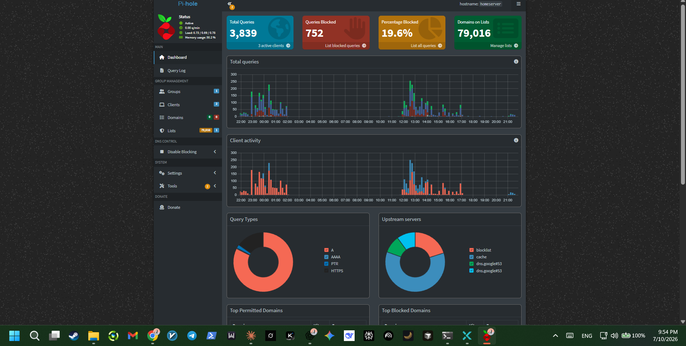
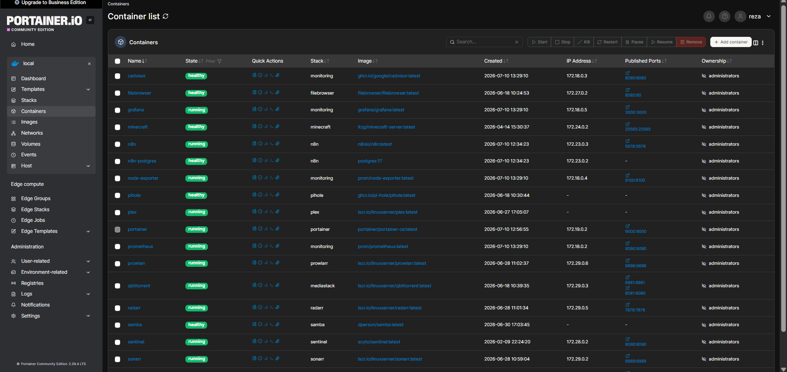

# Network Services

## Pi-hole — network-wide DNS filtering

Pi-hole intercepts DNS for every device on the network, blocking ads and trackers at the DNS level instead of relying on per-browser extensions. Currently filtering roughly 20% of all queries against an active blocklist:

## Portainer — container management

A web UI for the full Docker environment: all containers, their health status, images, and published ports in one place. Useful both for day-to-day management and as a quick way to eyeball the state of the whole stack:

## Samba

Provides LAN-accessible file shares from the server's storage — used for moving files between devices on the network without a cloud intermediary.
