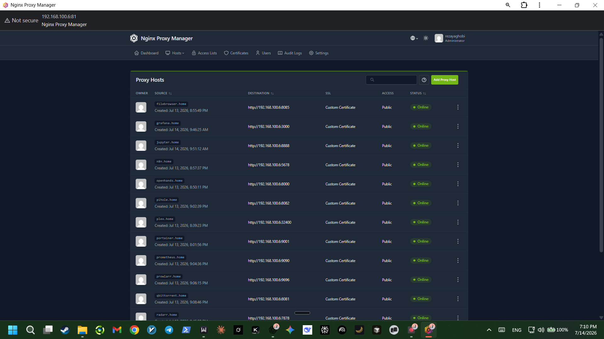

# Reverse Proxy

[Nginx Proxy Manager](https://nginxproxymanager.com/) sits in front of every service on the LAN, replacing `http://<ip>:<port>` with friendly `<service>.home` names and trusted local HTTPS. Runs as its own Compose stack under `nginx-proxy-manager/`.



## Why

With a dozen-plus services running, remembering a different port per service didn't scale. NPM proxies each one behind a single hostname, and Pi-hole (already running for network-wide DNS filtering) resolves those hostnames to the server's LAN IP for every device on the network.

## Port 80/443 conflict with Pi-hole

Pi-hole runs in `network_mode: host`, which meant it was already bound directly to ports 80 and 443 for its own admin web UI — the same two ports NPM needs for HTTP/HTTPS proxying. Resolved by moving Pi-hole's web interface off those ports entirely via an FTL environment variable:

```yaml
environment:
  FTLCONF_webserver_port: '8082o,[::]:8082o'
```

The `o` suffix marks the bind as optional so Pi-hole won't crash if the port's briefly unavailable. Pi-hole's DNS service (port 53) is untouched — only its web UI moved.

One follow-up gotcha: the first replacement port chosen (8081) turned out to already be in use by qBittorrent's web UI, so the two silently conflicted before landing on 8082. Worth checking `sudo ss -tulnp | grep LISTEN` for actual bound ports before picking a replacement — `docker ps` alone doesn't show ports for host-network containers.

## Local trusted HTTPS with mkcert

Since `.home` isn't a real public domain, Let's Encrypt can't issue certificates for it — there's no way to prove domain ownership over the public internet for a name that only resolves on the LAN. [mkcert](https://github.com/FiloSottile/mkcert) solves this by creating a local certificate authority, trusted on each device, that can then sign certificates for any local name.

**First attempt: a wildcard cert (`*.home`) — this doesn't work.** Browsers reject wildcards on single-label TLDs like `.home` for security reasons (mkcert itself warns about this at generation time). Every proxied host showed `NET::ERR_CERT_COMMON_NAME_INVALID` despite the CA being correctly trusted.

**Fix: generate one certificate listing every hostname explicitly** instead of a wildcard:

```bash
mkcert filebrowser.home grafana.home n8n.home openhands.home pihole.home \
  plex.home portainer.home prometheus.home prowlarr.home qbittorrent.home \
  radarr.home sonarr.home whisparr.home sentinel.home
```

This produces one cert/key pair covering all listed names, uploaded into NPM as a single Custom SSL Certificate and attached to every proxy host. Adding a new service later just means either regenerating this list to include the new name, or issuing a small separate single-name cert for it — either works, since NPM assigns certificates per proxy host independently.

**The CA itself only needs installing once per device** (`mkcert -install` on the server, then the resulting root CA file installed into each client's trusted root store — Windows via Certificate Manager, Android via Settings → Encryption & credentials, iOS via a config profile *plus* enabling full trust under Certificate Trust Settings, which is easy to miss).

## Troubleshooting notes

- A single host showing a stale/invalid cert after everything else worked turned out to be browser-side TLS session caching, not a real misconfiguration — confirmed by testing the same URL in an Incognito window, where it loaded cleanly. Restarting the NPM container forced a clean reload and resolved it, though clearing HSTS state for the domain (`chrome://net-internals/#hsts`) is a more targeted fix for the same symptom.
- Some LAN devices need their DNS pointed at Pi-hole explicitly (per-device static DNS, or configured once at the router's DHCP settings) for `.home` names to resolve at all — this is separate from the certificate/proxy setup above.
