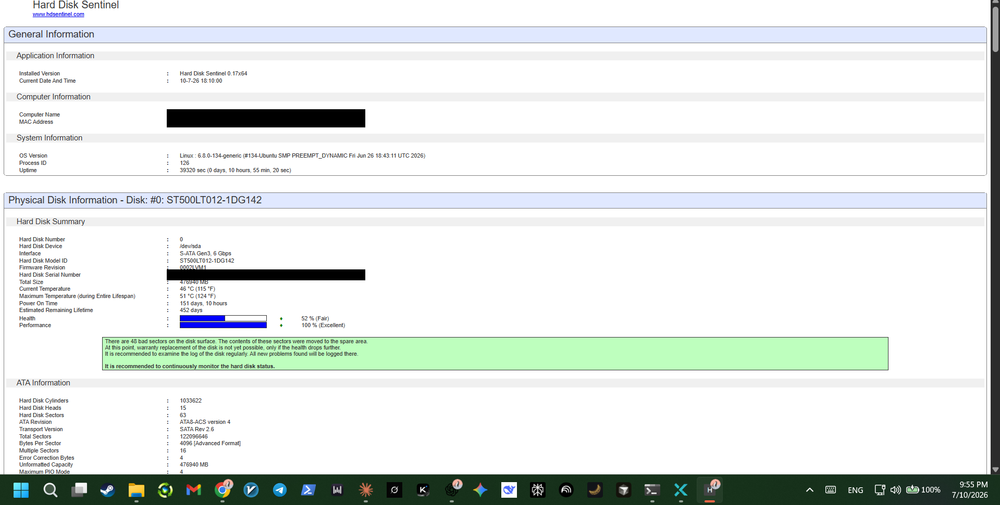

# Storage Health

Disks fail silently until they don't. Hard Disk Sentinel runs continuously to surface S.M.A.R.T. data — temperature, reallocated sectors, estimated remaining lifetime — before a drive fails outright rather than after.

## What this catches

- Bad sector counts and whether they've been reallocated to spare area
- Temperature trends over the drive's lifetime
- An estimated health percentage and remaining lifetime, so a degrading drive can be replaced proactively instead of discovered after data loss

Identifying details (hostname, MAC address, disk serial number) are redacted from the screenshot above before publishing.
