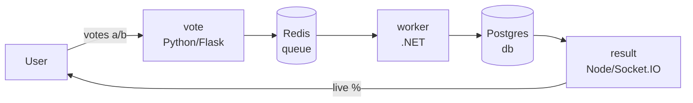
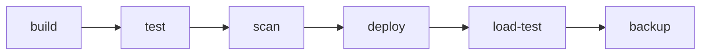
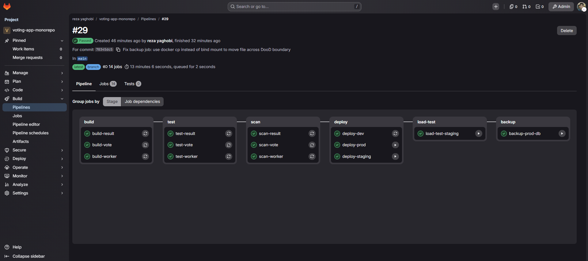
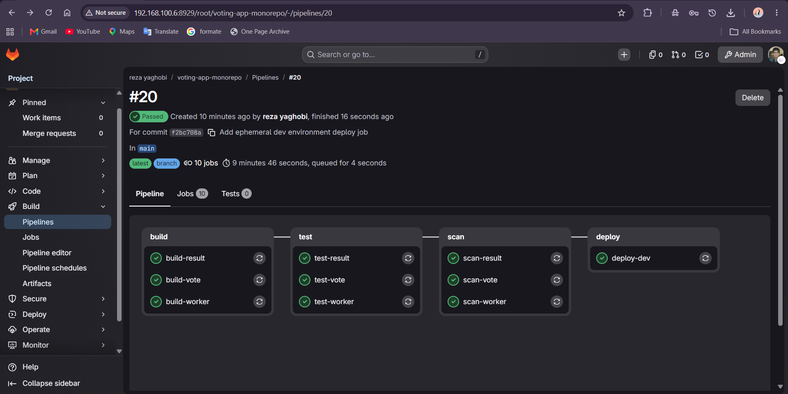
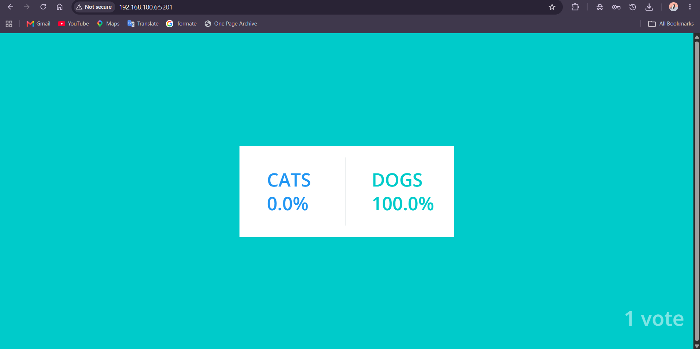
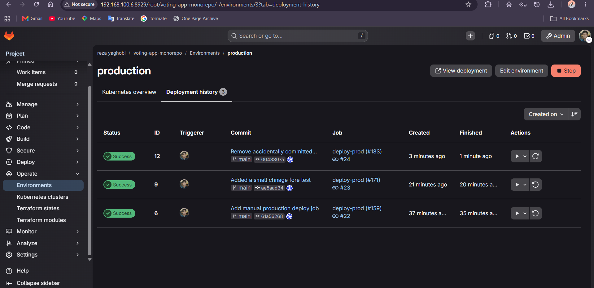
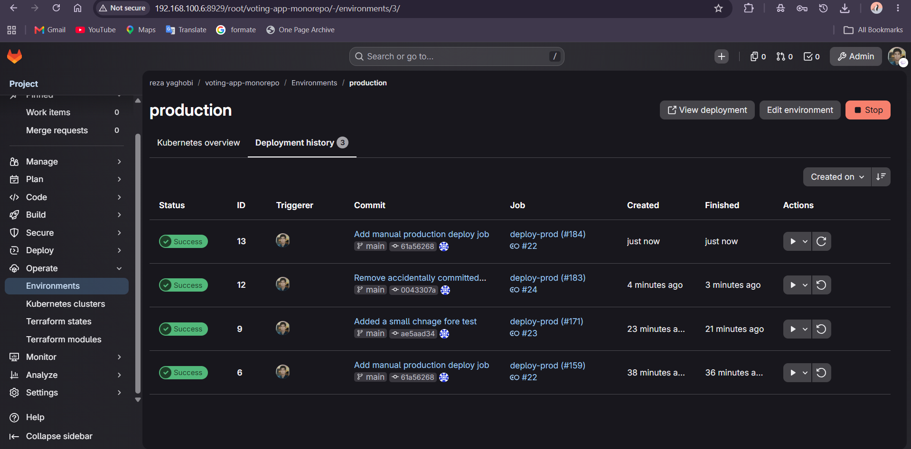
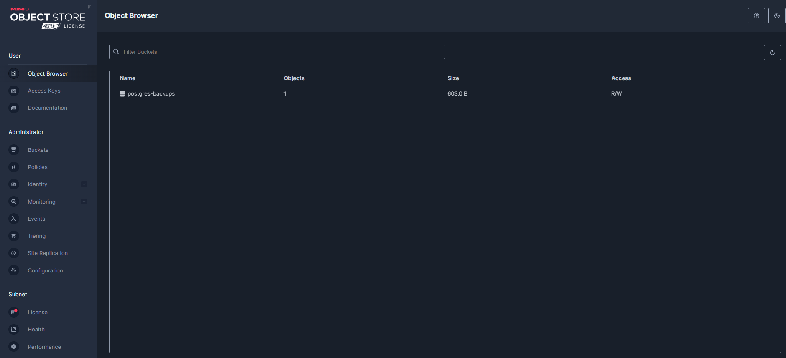

# Voting App — Mono-Repo CI/CD

A full production-shaped CI/CD pipeline built around Docker's [example-voting-app](https://github.com/dockersamples/example-voting-app) reference architecture, as a self-hosted GitLab DevOps coursework project. Every service (`vote`, `result`, `worker`) lives in one repository, with a single pipeline covering build, test, vulnerability scanning, multi-environment deployment with rollback, load testing, and automated database backups to object storage.

This is the mono-repo half of a two-part assignment. See [Voting App — Multi-Repo CI/CD](Voting-App-Multirepo.md) for the split-repository version covering the same requirements with `vote`, `result`, `worker`, and a `devops` project as independent GitLab projects.

## Architecture



- **vote** — Flask app, takes a vote, pushes it onto a Redis queue
- **worker** — .NET background service, drains the Redis queue, writes each vote into Postgres
- **result** — Node/Express app with Socket.IO, reads Postgres, pushes live results to the browser
- **redis** / **postgres** — infrastructure, not application code, but part of every environment's stack

## Repository layout

```
voting-app-monorepo/
├── vote/
│   ├── Dockerfile
│   └── ... (Flask app source)
├── result/
│   ├── Dockerfile
│   └── ... (Node app source)
├── worker/
│   ├── Dockerfile
│   └── ... (.NET app source)
├── loadtest/
│   └── vote-load-test.js
├── docker-compose.deploy.yml
├── .gitignore
└── .gitlab-ci.yml
```

## Pipeline overview

Six stages, each gating the next:





| Stage | Jobs | Trigger |
|---|---|---|
| build | build-vote, build-result, build-worker | automatic |
| test | test-vote, test-result, test-worker | automatic |
| scan | scan-vote, scan-result, scan-worker | automatic |
| deploy | deploy-dev, deploy-staging, deploy-prod | dev: automatic · staging/prod: manual |
| load-test | load-test-staging | manual |
| backup | backup-prod-db | manual |

All three services share a `.build-service` / `.test-service` / `.scan-service` hidden-job template pattern (`extends:`), the same approach used in [Custom CI Runner Images](CI-Custom-Images.md) — adding a fourth service later would be a handful of lines, not a duplicated block.

## Build

Standard `docker build` + push to this project's own registry namespace (`registry.gitlab.home/root/voting-app-monorepo/<service>`), tagged both `:latest` and `:$CI_COMMIT_SHORT_SHA`. Uses the same host-socket Docker-outside-of-Docker pattern as every other project in this homelab — job containers build against the host's existing Docker daemon rather than a nested one, keeping RAM overhead down.

`build-vote` includes `--pull` specifically (see [Scanning](#scanning) below for why); `result` and `worker` rely on Docker's layer cache normally, since forcing a fresh pull on every build isn't needed once the base image itself is patched.

## Test

Lightweight smoke tests rather than the upstream project's full Selenium integration suite — a deliberate choice given this hardware's RAM constraints. Each service's built image is started standalone, and:

- **vote / result** — a separate `curl` container, on a throwaway per-job Docker network, hits the service's root endpoint and expects `200`
- **worker** — has no HTTP surface (it's a background queue consumer), so the check instead confirms the container is still *running* a few seconds after start — a crash-on-startup (bad connection string, missing dependency) shows up as an unexpected exit; a healthy worker just sits retrying its Redis/Postgres connections, which is expected in isolation from the other services

## Scanning

**Trivy**, run as a hard gate (`--exit-code 1`), not just a report. Getting here took several real fixes, not just enabling a flag:

- **`aquasec/trivy`'s image has `ENTRYPOINT` hardcoded to `trivy` itself** — GitLab's default `sh -c "..."` invocation becomes `trivy sh -c "..."`, which fails with `unknown command "sh"`. Fixed with `image: { name: ..., entrypoint: [""] }`.
- **Trivy's vulnerability DB download failed with a 403** from `mirror.gcr.io` — consistent with the same sanctions-related infrastructure blocks hit elsewhere in this homelab (see [GitLab CI/CD](GitLab-CICD.md)). Fixed by overriding `TRIVY_DB_REPOSITORY` to pull from `ghcr.io` instead, and caching the downloaded DB via GitLab Runner's `/cache` mount so this only has to succeed once, not every pipeline run.
- **`--ignore-unfixed`** — added after discovering the base Debian image carries CVEs marked `will_not_fix` by Debian itself (e.g. `zlib1g`) that no Dockerfile change could ever resolve. Without this flag, the gate would fail permanently on things genuinely outside this project's control.

Real, fixable findings that came out of this and were actually resolved, not suppressed:

| Service | Finding | Fix |
|---|---|---|
| `vote` | ~30 Debian OS CVEs, all with real fix versions available (`openssl`, `libsystemd0`, `perl-base`, etc.) | Added `apt-get upgrade -y` to the Dockerfile; forced `--pull` on build so the fix actually takes on rebuild |
| `worker` | `Npgsql` CVE-2024-32655 (HIGH), `System.Drawing.Common` CVE-2021-24112 (**CRITICAL**) | Bumped `Npgsql` 4.1.9 → 8.0.3 in `Worker.csproj`; explicitly pinned `System.Drawing.Common` 5.0.3 (a transitive dependency, not directly referenced, that was resolving to an old vulnerable version) |
| `result` | Dozens of findings (`tar`, `sigstore`, `minimatch`, `ip-address`) that turned out to be bundled inside `npm`'s own internal tooling, not the app's real dependencies | Removed the global `npm`/`npx`/`corepack` install from the production image stage entirely — the container only ever runs `node server.js`, never `npm`, so this tooling was pure unused attack surface |
| `result` | `socket.io-parser`/`ws` outdated within the existing `^4.7.2` semver range | `npm update` — non-breaking, respects the existing version constraint |
| `vote` | Two vendored CVEs (`jaraco.context`, `wheel`) bundled inside an old `setuptools` | **Left as a documented `.trivyignore` exception** — the real fix (`pip install --upgrade pip setuptools`) requires reaching `files.pythonhosted.org`, which is unreachable from this network (confirmed: `pypi.org` resolves fine, `files.pythonhosted.org` times out — a different, narrower gap than the sanctions-blocked registries elsewhere in this project, cause not fully diagnosed). Documented with a dated comment rather than silently ignored. |

## Deploy — three environments

```yaml
services:
  redis: {...}
  db: {...}
  vote:
    image: "${CI_REGISTRY_IMAGE}/vote:${IMAGE_TAG}"
    ports: ["${VOTE_PORT}:80"]
  result:
    image: "${CI_REGISTRY_IMAGE}/result:${IMAGE_TAG}"
    ports: ["${RESULT_PORT}:80"]
  worker: {...}
```

One parameterized `docker-compose.deploy.yml`, reused by all three environments — only `IMAGE_TAG`, port numbers, and the Compose *project name* (`-p`) differ between them, which is what keeps environments fully isolated on a single host:

| Environment | Compose project | Ports (vote/result) | Trigger | Lifecycle |
|---|---|---|---|---|
| dev | `voting-dev` | 5100/5101 | automatic, every push | **ephemeral** — spun up, smoke-tested via `docker compose exec`, torn down (`down -v`) in the same job |
| staging | `voting-staging` | 5200/5201 | manual | persistent |
| production | `voting-prod` | 5300/5301 | manual | persistent |

Every service has an explicit `mem_limit` in the compose file — a deliberate guardrail, not an afterthought, given this host has as little as ~2.7GB free at times and up to three environments' worth of containers could theoretically exist at once.




## Rollback and rollout

`environment: name: staging` / `name: production` on each deploy job is what makes GitLab track full deployment history natively — no custom rollback scripting needed, just structuring the jobs correctly.

Proven live, not just configured: after two real deployments to production (the original content, then a deliberate template edit), the Environments UI showed full history —



Clicking the rollback icon on the earliest deployment redeployed that exact image, confirmed by the browser reverting to the original content with zero terminal interaction — and GitLab recorded it as a **new** deployment entry rather than rewriting history, preserving a complete, honest audit trail:



## Load testing

**k6**, chosen over Locust/JMeter for being a single static binary with no separate agent/server to run — matters on constrained hardware. Runs against **staging**, never production, as a manual job.

```javascript
export const options = {
  stages: [
    { duration: '10s', target: 5 },
    { duration: '20s', target: 5 },
    { duration: '5s', target: 0 },
  ],
  thresholds: {
    http_req_duration: ['p(95)<1000'],
    http_req_failed: ['rate<0.05'],
  },
};
```

Deliberately modest load (5 virtual users, ~35s) — proving the mechanism and getting real latency data, not stress-testing to failure on hardware this constrained. `thresholds` make this a genuine gate: exceeding p95 latency or failure-rate limits fails the job, not just logs a warning.

Hit the same `ENTRYPOINT`-hardcoded-to-the-tool-itself issue as Trivy — `grafana/k6`'s image needed the identical `entrypoint: [""]` override.

## Backup to object storage

Automated `pg_dump` of the production database, compressed and pushed to **MinIO** (self-hosted, `-cpuv1` release tag — see [Custom CI Runner Images](CI-Custom-Images.md) for why this hardware needs that specific tag).

```bash
docker exec voting-prod-db-1 pg_dump -U postgres postgres | gzip > "$BACKUP_FILE"
docker create --name mc-helper-$CI_JOB_ID --entrypoint sh minio/mc:RELEASE.2025-08-13T08-35-41Z-cpuv1 -c "sleep 300"
docker start mc-helper-$CI_JOB_ID
docker cp "$BACKUP_FILE" mc-helper-$CI_JOB_ID:/tmp/"$BACKUP_FILE"
docker exec mc-helper-$CI_JOB_ID mc cp /tmp/"$BACKUP_FILE" localminio/postgres-backups/
```

**The real lesson here**: the first version of this job used `docker run -v "$(pwd)":/backup ...` to hand the dump file to a throwaway `mc` container, and it silently failed — `mc` reported the file "not found" despite the dump succeeding. The cause: this job's `docker run` calls execute against the **host's** Docker daemon (Docker-outside-of-Docker), so a bind mount (`-v`) always resolves against the **host's** filesystem — never the CI job container's own filesystem, regardless of which container issued the command. `$(pwd)` inside the job container is a path that simply doesn't exist on the host. The fix was switching to `docker cp`, which streams the file over the Docker API connection itself rather than depending on a shared filesystem path — the correct tool for moving a file *into* a container across a DooD boundary.



## Registry hygiene

24-25 tags accumulated per service purely from iterative pipeline debugging during development. A cleanup policy was configured (keep 10 most recent, remove tags older than 30 days, **no keep-pattern** — see the regex gotcha below), but running it via the UI's "Run cleanup now" and via the Rails console both returned `deleted_size: 0` despite `status: :success` — a known limitation on self-managed GitLab instances without the registry's metadata database feature enabled. Rather than chase that setup for a learning project, tags were pruned manually through the UI as a one-time pass, down to the 3 most recent per service.

**Trade-off worth naming honestly**: keeping only 3 tags means any rollback attempt reaching further back than that would fail — the deployment history entry would still exist in GitLab, but the underlying image tag it depends on would no longer be pullable. In a real production system this is exactly why cleanup policies are usually tuned generously (10-20+ tags) rather than aggressively; disk is cheap, losing the ability to roll back during a real incident is not. Three was a deliberate, informed trade-off for this project's disk constraints, not an oversight.

## Lessons learned

- Images with `ENTRYPOINT` hardcoded to the tool itself (`trivy`, `k6`, `mc`) break GitLab's default `sh -c "..."` script invocation with a confusing "unknown command sh" error — the fix (`entrypoint: [""]`) is the same every time, but only obvious once you've hit it once.
- Docker-outside-of-Docker bind mounts (`-v host:container`) always resolve against the **host's** filesystem, regardless of which container issued the `docker run` command — `docker cp` is the correct tool for moving a file across that boundary, not a shared path.
- A vulnerability scanner reporting hundreds of findings in a Node/npm-based image doesn't necessarily mean the app's own dependencies are outdated — bundled tooling (`npm`'s own internal packages, unused dev tools left in a production image) can dominate the report. Splitting build stages so production images only contain what they actually run at runtime resolves this at the source.
- `--ignore-unfixed` is necessary for a vulnerability scan to be a *useful* gate on any Debian-based image — some CVEs are permanently `will_not_fix` by the distro itself, and failing a pipeline on those forever provides no signal.
- GitLab Container Registry cleanup policies can report `status: :success` while deleting nothing, on self-managed instances without the registry metadata database — success status alone doesn't confirm actual cleanup; check `deleted_size` specifically.
- A "keep only N tags" cleanup policy is a real trade-off against rollback depth, not just a disk-space optimization — worth deciding deliberately, not defaulting to the most aggressive setting.
- `git add -A` after running any local tool that writes into the working directory (like `docker run -v $(pwd):/app npm update`) can silently stage hundreds of vendored dependency files if `.gitignore` isn't already in place — worth adding `.gitignore` before the *first* commit on any new project, not after the fact.
