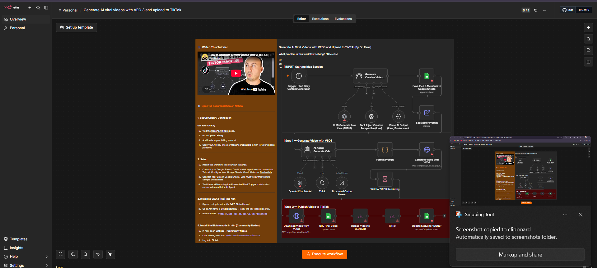

# Workflow Automation

n8n runs self-hosted (backed by its own Postgres instance) for building automated workflows — connecting APIs, scheduling tasks, and chaining actions without needing separate scripts for each one.

> **Note:** the workflow shown above is a community template being explored in the editor. _Replace this section with a description of a workflow you've actually built or customized — what it automates, what triggers it, and why you built it. A specific, real example is far more convincing here than a generic one._

## Why self-hosted n8n

Cloud automation platforms usually cap free usage or require a subscription for private workflows. Running n8n on the homelab keeps workflows private, removes execution limits, and integrates naturally with the rest of the self-hosted stack.
