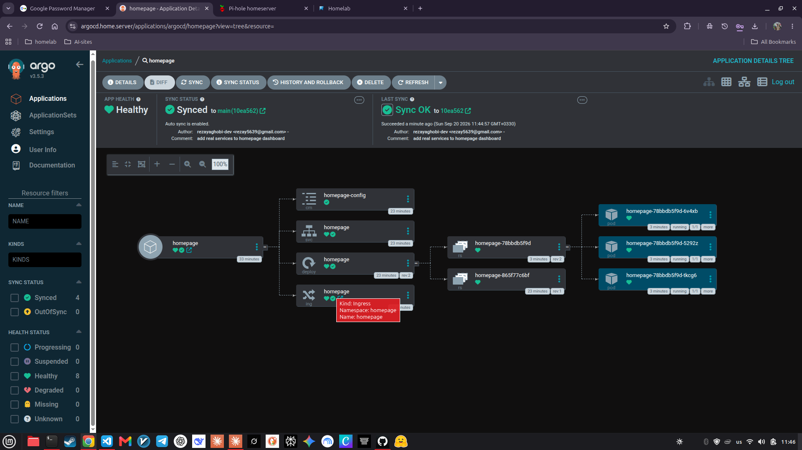

# ArgoCD — GitOps for K3s

[Argo CD](https://argoproj.github.io/cd/) is a declarative continuous delivery tool for Kubernetes. In this homelab it's the bridge between this repo and the K3s cluster: **git is the source of truth**, and Argo CD continuously watches the git repository, reconciling the cluster to match whatever manifests are tracked on `main`.

Add a Deployment, change a resource limit, delete an Ingress — commit it, and Argo CD pulls the change into the cluster automatically, no manual `kubectl apply` required. It's Kubernetes-as-GitOps rather than Kubernetes-as-state-you-manually-maintain.

## Repo layout

Argo CD apps in this repo follow a split structure:

```
kubernetes/
├── apps/
│   └── homepage/
│       ├── deployment.yaml
│       ├── service.yaml
│       ├── configmap.yaml
│       ├── ingress.yaml
│       └── kustomization.yaml
└── argocd-apps/
    └── homepage/
        └── homepage-app.yaml
```

- **`kubernetes/apps/<name>/`** — the actual Kubernetes workload manifests for each app. Bundled with `kustomization.yaml` (Kustomize), so common operations like renaming a namespace or swapping an image tag can be done via patches rather than editing every YAML. See [`kubernetes/apps/README.md`](../kubernetes/apps/README.md) for details.
- **`kubernetes/argocd-apps/<name>/<name>-app.yaml`** — the Argo CD `Application` object that tells Argo CD "watch this git path, deploy it into this namespace." These live one level up, deliberately separate from `kubernetes/apps/`, so Argo CD never watches its own Application definitions and can't recurse.

The first app managed this way is the **Homepage** dashboard — see `kubernetes/apps/homepage/` for the manifests and `kubernetes/argocd-apps/homepage/homepage-app.yaml` for the Application.

## Application manifest

Each app gets a thin `Application` manifest. The Homepage one looks like:

```yaml
apiVersion: argoproj.io/v1alpha1
kind: Application
metadata:
  name: homepage
  namespace: argocd
spec:
  project: default
  source:
    repoURL: https://github.com/rezayaghobi-dev/homelab
    targetRevision: main
    path: kubernetes/apps/homepage
  destination:
    server: https://kubernetes.default.svc
    namespace: homepage
  syncPolicy:
    automated:
      prune: true
      selfHeal: true
    syncOptions:
      - CreateNamespace=true
```

- `path` points at the `kubernetes/apps/<name>/` directory — Argo CD treats the `kustomization.yaml` there as the entry point.
- `automated.prune = true` — anything deleted from git gets deleted from the cluster.
- `automated.selfHeal = true` — if someone edits the live cluster out-of-band, Argo CD notices the drift and corrects it.
- `CreateNamespace=true` — the destination namespace is created automatically if it doesn't exist.

This is the current state of the cluster's GitOps control loop: Argo CD is the reconciler, this repo is the spec, and the cluster state is the realized output.

## How traffic reaches an app

K3s itself doesn't own ports 80/443 — the Docker-side Traefik reverse proxy already binds them (see [Traefik](Traefik.md)). So the exposure pattern for an Argo CD-managed app is:

```
Client → Traefik (:443) → ingress-nginx NodePort → Ingress → Service → Pod
```

1. **Traefik** (Docker container, `network_mode`-adjacent to the host) terminates TLS (`*.home.server` via mkcert) and routes based on `Host` header.
2. **ingress-nginx** runs *inside* the K3s cluster. Its `Service` is exposed as a **NodePort** on the host, giving Traefik a stable `homeserver:<nodeport>` target to forward to — the same pattern used for pre-ArgoCD K3s workloads (see [K3s — Exposure pattern](K3s.md#Exposure-pattern)).
3. **ingress-nginx** (the in-cluster Ingress controller) receives the request, matches it against `Ingress` resources in the cluster, and forwards to the right `Service`.
4. **Service** → **Pod** as normal Kubernetes routing.

This keeps a single TLS termination layer (Traefik) and a single DNS entry point (`*.home.server` via Pi-hole), while letting in-cluster Ingress resources carry the routing logic as code alongside the workloads they protect.



## Adding a new app

1. **Create the workload manifests.**
   ```bash
   mkdir kubernetes/apps/<name>
   ```
   Drop your `deployment.yaml`, `service.yaml`, `configmap.yaml`, `ingress.yaml` (if any), and a `kustomization.yaml` listing them as resources. The `kustomization.yaml` is required — Argo CD uses it as the entry point for the `path`.

2. **Create the Application manifest.**
   ```bash
   mkdir kubernetes/argocd-apps/<name>
   ```
   Copy `kubernetes/argocd-apps/homepage/homepage-app.yaml` as a template into `kubernetes/argocd-apps/<name>/<name>-app.yaml`. Update the three fields that vary:
   - `metadata.name` → the new app's name
   - `spec.source.path` → `kubernetes/apps/<name>`
   - `spec.destination.namespace` → the namespace the app runs in

3. **Apply the Application once.**
   ```bash
   kubectl apply -f kubernetes/argocd-apps/<name>/<name>-app.yaml
   ```
   Argo CD picks it up immediately and creates the app. After this initial `kubectl apply`, **all** future changes — including edits to the manifests, resource changes, even namespace recreation — flow through git alone. Argo CD's `selfHeal` and `prune` will keep the cluster in sync with whatever is on `main`.

4. **Point Traefik at it.** The app's Ingress will typically be served by the in-cluster ingress-nginx behind a NodePort. Add or reuse a Traefik router (Docker labels on the ingress-nginx Service itself, or a `dynamic/` file-provider entry if the Service isn't on `web_net`) so `<name>.home.server` resolves to the right NodePort.

That's it — commit, push, and Argo CD handles the rest. No manual `kubectl` on the cluster; no drift between what's running and what's in git.

## Why this matters

On a single-node learning cluster this matters less for HA and more for discipline: writing a `Deployment` that actually ships is different from applying one manually and calling it done. GitOps forces the manifests and the running cluster to be the same thing — the diff in the Argo CD UI is an honest report of "what happens if I merge this PR," not a best-effort guess at what `kubectl apply` did last time.

[← Back to Home](Home.md)
